# Griotte (GR IoT)

This project is a DIY network of low cost air quality sensors for individual homes, mostly independent from the home network.

I am aware that low cost sensors are not precise, so that wasn't my goal. Rather, I wanted to keep track of trends over time: does a room in the house have really bad air flow, are there moments in the day that I should be wary of...

(lots of documentation is missing; please feel free to let me know if you are interested, that will boost me)


## Overview

I wanted an easy to read overview of the air quality in my house, with controls for the time period and the ability to narrow down to each room.

My network looks like this (here with 3 sensors):
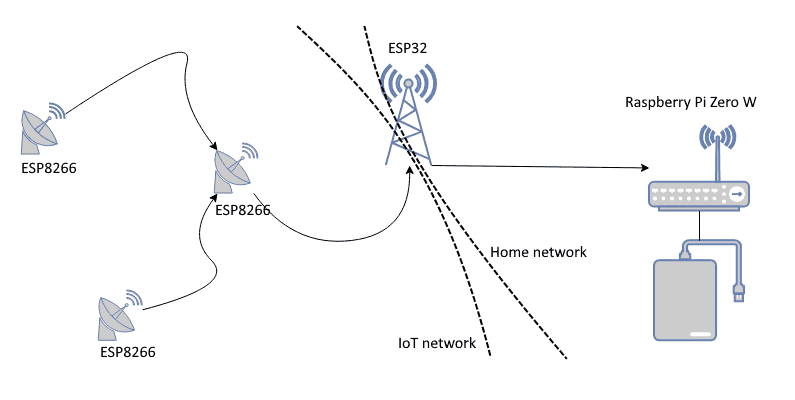

The ESP8266 nodes are firmly on their own WiFi mesh network, while the Raspberry Pi is on the home network. The ESP32 is connected to both networks.

Whole house overview (all day average):
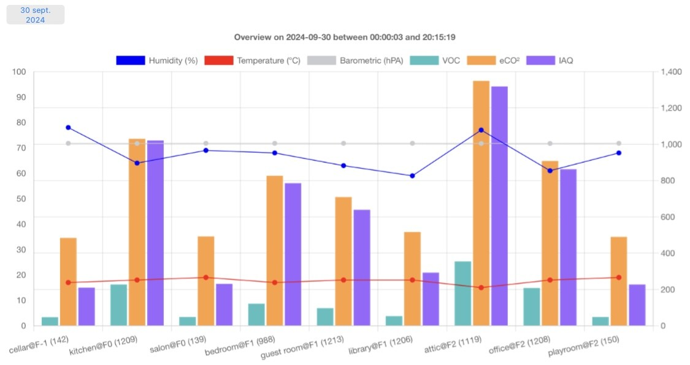

A griotte:
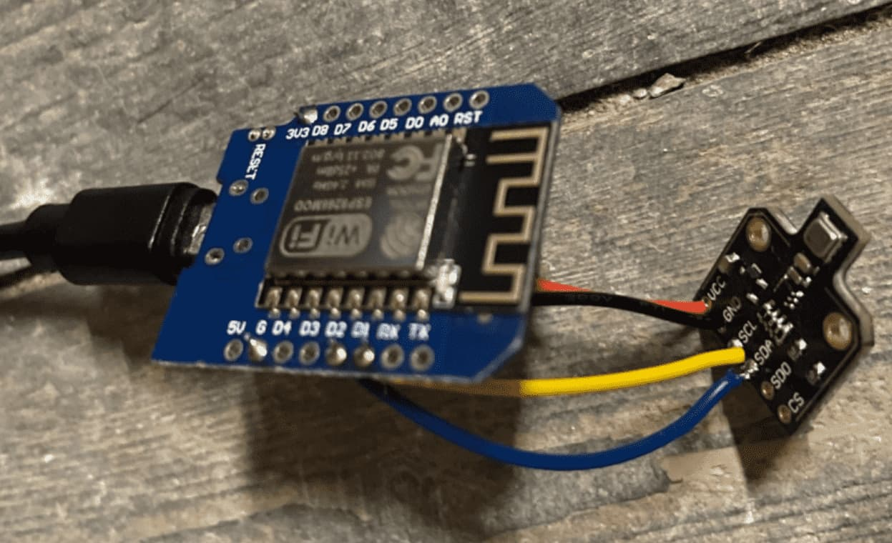

For those so inclined, the following are some more technical examples:

Tailing the web server on an SSH console (helps to see how long it takes to record readings from each griotte):
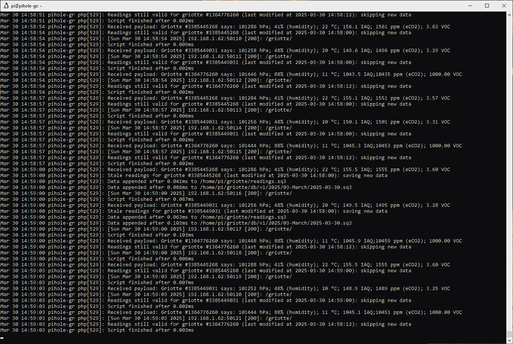

Log from one griotte on the serial console as the mesh network tries to settle after new nodes came online:
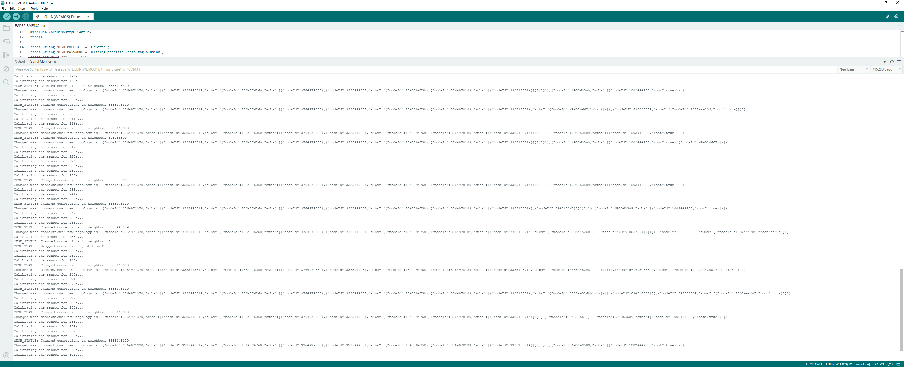

Resource usage of the web server process on the Raspberry Pi Zero W (freshly rebooted, the PID 529 here is this process):
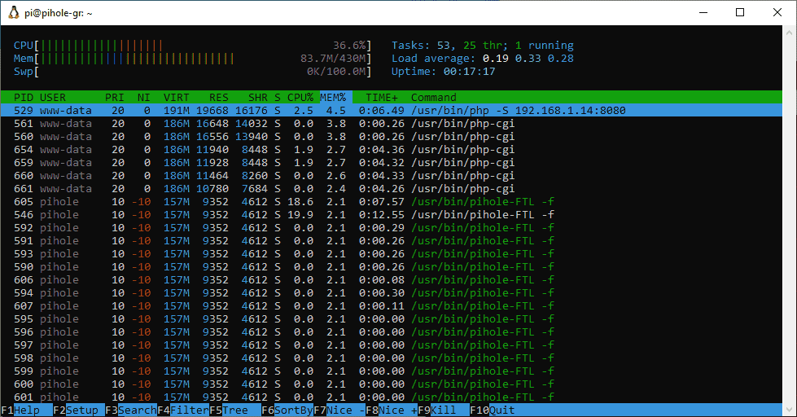

Another example of this on video with three programs composed on the screen (htop is top left with the griotte webserver highlighted, btop is center right also with the griotte webserver highlighted and journalctl is bottom):

[](https://www.youtube.com/watch?v=f3GzV0eSte4)

After two weeks of uptime, this process is still using a negligible amount of memory (about 13% or 55 MB) and CPU (2%):
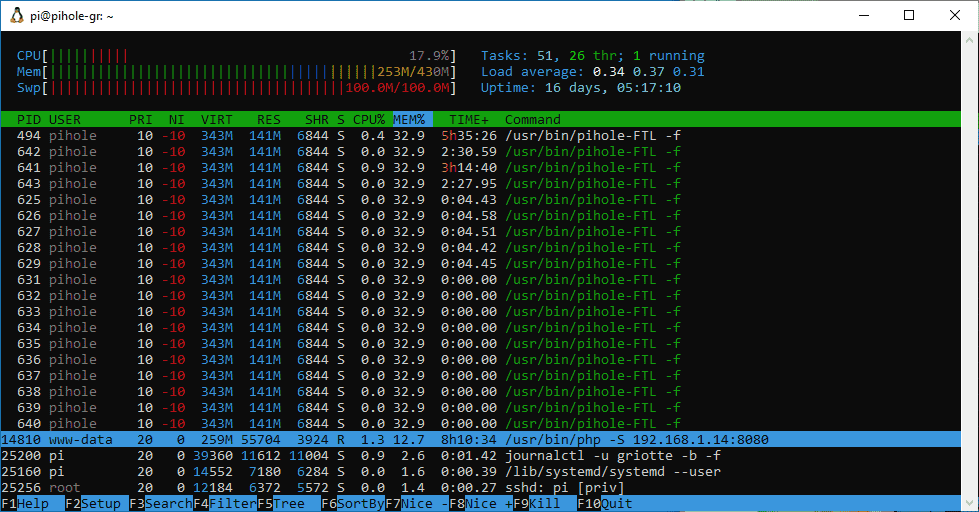
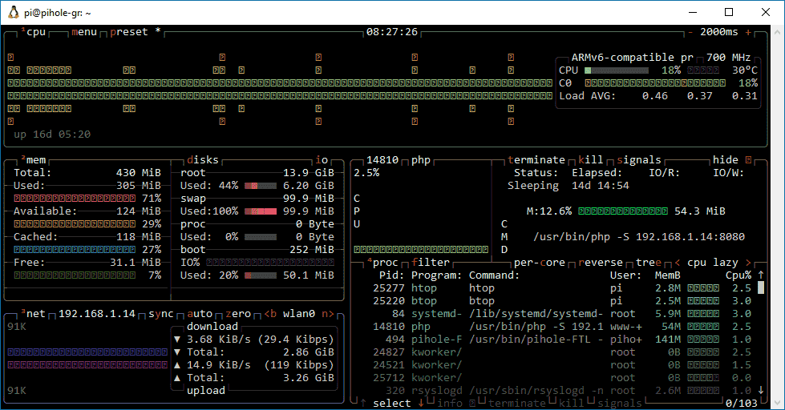

At this point, the system SWAP was taken over by a process (probably the PiHole itself). A reboot cleaned everything up and the griotte webserver started on its own.


## Approximate cost

Let's say 3 sensors (these costs are rounded up from when I bought the parts):

|unit price (€)|nb|part|
|---|---|---|
|6|3|BME680 sensor|
|2|3|ESP8266 micro controller|
|3|1|ESP32 micro controller|
|4|1|USB wall plug (bundle of 5)|
|1|1|USB cable (bundle of 5)|
|19|1|Raspberry Pi Zero W|
|2|1|MicroSD|
|2|1|wires for soldering (bundle of 100)|
|4|1|soldering iron|
|3|1|soldering flux/paste/wire|
|3|1|soldering mat|

As I mentioned earlier, the BME680 sensor is not reliable enough for precise readings. This is because it simply measures an electrical resistance across its surface. For better readings, try one of the laser based modules (I haven't).

There are other models and brands of air quality sensors (ENS160 at €5 a piece for example, or SCDC40 at €15 a piece). My program doesn't work with them yet.

(Also, should you need a soldering kit, there are probably better deals including holding claws, which I find very useful, and perhaps a magnifying glass + lights; your choice.)

Total cost for x3 griottes:

|Total (€)|nb||
|---|---|---|
|32|3+1|Griottes|
|21|1|Storage|

That's €32 for only the micro controllers and sensors, or €53 with the Pi Zero if you don't have one laying around already, or less than €65 if you need to buy everything from the list. Don't forget ventilation for the fumes when soldering.

You may also find it helpful to have a spare keyboard & screen and the corresponding cables when working with your Pi Zero. In that case, pay close attention to your chosen Pi's documentation for the connectors.

For reference, my PiZW0 is handling a dozen of these griottes with no issues, in addition to its customary PiHole duties. This is as cheap as you can go with MicroSD storage. Feel free to add backups on top of that.

Additional requirement: A computer with the same kind of USB port available, that these cables are meant for.


## A- Hardware components: ESP8266, BME680, ESP32, Raspberry Pi Zero W

This is a bunch of computer parts that will need to be soldered or plugged together.

/!\ Soldering equippment needed: solder iron, solder paste/flux, colored wires, mask, ventilation etc.

I wanted to build a network of low cost and low power devices. The main objective was ease of setup more ease of build: I should be able to make (solder & flash) one griotte, place it wherever in the house and the network would sort itself out.

The little sattelites represent my sensors, generally called nodes but I refer to them as griottes.


There is a number of griottes around the house, each built with a BME680 sensor attached to an ESP8266 micro controller, and they self organize into a coherent network (called a mesh network) over a WiFi network. This means that I can unplug a griotte and then plug it back in another part of the house, and they will all find a new network map by themselves, without my involvement. Obviously, I still need to take WiFi signal strength into account, because their antenna is minimal. In my case, as long as there is one griotte per room, it works fine.

A central unit, built with an ESP32 micro controller, receives readings from each griotte, meaning every 3 seconds because that is the shortest delay allowed by the BME680 sensor. This micro controller is located close to my home WiFi router because it needs to bridge the IoT network and my home network, and it forwards all the readings to a dedicated mini computer on my home network for storage. It doesn't need to be in close proximity to more than one of the griottes, since they self organize around this unit. This is the "root" of the mesh WiFi.

The two WiFi networks must share the same channel for this to work.

Finally, a small computer resides on my home network with a web server to gather & store all the readings that the ESP32 is forwarding. I chose to use my existing Raspberry Pi Zero W for this, because 1- it was already there, 2- it has a webserver already in the form of a PiHole and 3- that means it comes preinstalled with a programming language that I know well: PHP. Now, I understand this is very specific to me, and that PiHole v6 may change this. Regardless...

The web server determines which readings to store and which to ignore, because I don't actually need to store readings every 3 seconds for every node. I prefer to waste a little WiFi bandwidth, it helps with reliability.

_To sum up: each ESP8266 node needs to be able to talk to at least one other ESP8266, and at least one of them needs to be in range of the single ESP32, which in turn needs to be able to reliably reach the RPI0W._


## B- Software components: Arduino IDE

This is programming code that needs to be compiled and flashed to the ESP8266 and ESP32 hardware.

There are two pieces of software that need to be written:
- one for the ESP8266 and its attached BME680 sensor;
- the other for the ESP32.

For this project though, I conflated both programs into one source file using numerous ifdef statements.

I went with Arduino IDE for its ease of use for a single project. I am a beginner in this, after all.

_/!\ When Arduino IDE starts, it will prompt you to update all your dependencies in one click. Do NOT do this, unless you are prepared for dependency headaches. Get in the habit of hitting the ESC key to cancel that prompt._

In this project is a file called "ESP32-BME680.ino": that's my program, also called sketch in the context of Arduino IDE. I failed to document the exact dependencies as I went along and added more and removed others, so I'll list everything here...

In the Arduino IDE Essential boards manager URL field (look it up in Preferences), this is what I have:

```
http://arduino.esp8266.com/stable/package_esp8266com_index.json,https://github.com/espressif/arduino-esp32/releases/download/3.0.4/package_esp32_dev_index.json,https://github.com/espressif/arduino-esp32/releases/download/3.0.4/package_esp32_index.json
```

Which translates to the following URLs, separated by a comma:
- http://arduino.esp8266.com/stable/package_esp8266com_index.json
- https://github.com/espressif/arduino-esp32/releases/download/3.0.4/package_esp32_dev_index.json
- https://github.com/espressif/arduino-esp32/releases/download/3.0.4/package_esp32_index.json

The Board Managers are what allow you to choose your ESP8266 and ESP32 devices in Arduino IDE so that you can interact with them: flash, debug _etc._ Flashing means writing the program to the device, and debugging (to me) mostly means having logs show up on the serial console.

The following are my installed Board Manager versions:
- Arduino ESP32 Boards v2.0.17 by Arduino
- ESP32 v2.0.17 by Espressif systems
- ESP8266 v3.1.2 by ESP8266 community

(one of these is probably not needed any more; you'll have to check depending the micro controllers you do buy, since their documentation supersedes this list)

If memory serves, the ESP32 board manager had to be held back even though there is a newer major version available.

My best guess at the actual libraries I was required to install were (some are installed automatically by Arduino IDE from the Includes, others aren't):

|Name|Version|Authors|URL|
|-|-|-|-|
|PainlessMesh|v1.5.0|Coopdis, Scotty Franzyshen, Edwin van Leeuwen, Germán Martín, Maximillian Schwartz, Doanh Doanh|https://gitlab.com/painlessMesh/painlessMesh|
|ArduinoJson|v6.21.5|Benoit Blanchon|https://arduinojson.org/|
|AsyncTCP|v1.1.4|dvarrel|https://github.com/dvarrel/AsyncTCP|
|ESPAsyncTCP|v1.2.4|dvarrel|https://github.com/dvarrel/ESPAsyncTCP|

(^ these last two are either/or)

The ArduinoJson library had to be held back even though there is a newer major version available.

For what it's worth, and in case I was mistaken with my short list, here are all the dependencies that I have on my computer:

|Name|Version|Authors|URL|
|-|-|-|-|
|ArduinoHttpClient|v0.6.1|Arduino|https://github.com/arduino-libraries/ArduinoHttpClient|
|Adafruit_BME680|v2.0.4|Adafruit|https://github.com/adafruit/Adafruit_BME680|
|Adafruit_BusIO|v1.16.1|Adafruit|https://github.com/adafruit/Adafruit_BusIO|
|Adafruit-GFX-Library|v1.11.10|Adafruit|https://github.com/adafruit/Adafruit-GFX-Library|
|Adafruit SSD1306|v2.5.11|Adafruit|https://github.com/adafruit/Adafruit_SSD1306|
|Adafruit Unified Sensor|v1.1.14|Adafruit|https://github.com/adafruit/Adafruit_Sensor|
|ArduinoJson|v6.21.5|Benoit Blanchon|https://arduinojson.org|
|AsyncTCP|v1.1.4|dvarrel|https://github.com/dvarrel/AsyncTCP|
|BME68x Sensor library|v1.2.44408|Bosch Sensortech|[1]|
|BSEC Softare Library|v1.6.1480|Bosch Sensortech|https://www.bosch-sensortec.com/software-tools/software/bsec/|
|ESP ASync WebServer|v3.0.6|ESP32Async|https://github.com/ESP32Async/ESPAsyncWebServer|
|ESPAsyncTCP|v1.2.4|dvarrel|https://github.com/dvarrel/ESPAsyncTCP|
|HttpClient|v2.2.0|Adrian McEwen |https://github.com/amcewen/HttpClient|
|PainlessMesh|v1.5.0|Coopdis, Scotty Franzyshen, Edwin van Leeuwen, Germán Martín, Maximillian Schwartz, Doanh Doanh|https://gitlab.com/painlessMesh/painlessMesh|
|PubSubClient|v2.8|Nick O'Leary|https://pubsubclient.knolleary.net|
|RTCLib|v2.1.4|Adafruit|https://github.com/adafruit/RTClib|
|SdFat|v2.2.3|Bill Greirman|https://github.com/adafruit/RTClib|
|TaskScheduler|v3.8.5|Anatoli Arkhipenko|https://github.com/arkhipenko/TaskScheduler|
|base64|v1.3.0|Densaugeo|https://github.com/Densaugeo/base64_arduino|
|bsec2|v1.7.2502|Bosch Sensortech|[1]|

[1] the official URL seems to be dead so here's another, and good luck! Or maybe someone archived/forked it on their account, or there is a replacement... https://github.com/BoschSensortec/Bosch-BME68x-Library


## C- Flashing a micro controller

I am by no means an expert in this, but here is my process.

Open up Arduino IDE and plug your ESP device in whichever USB port is available. This can't be through a USB hub, but directly in your PC. Or maybe it can but I don't know the specifics.

This is tough because the driver names in Arduino IDE tend to change over time. Best I can tell, these seem to be working fine:
|hardware|Arduino IDE driver|
|-|-|
|ESP8266|LOLIN(WEMOS) D1 mini (clone)|
|ESP32-C3|LOLIN C3 Mini|
|ESP32-C3|Heltec WiFi LoRa 32(V3)|

You can select this in Arduino IDE a few different ways. The most straightforward way is using the drop-down list near the menus at the top of the program: "Select other board and port..."

Make sure the Serial Monitor is open (enable it in the Tools menu) and that its baud rate matches the one in my program (that's 115200 baud).

If everything is working correctly, you should see something like this for ESP8266:
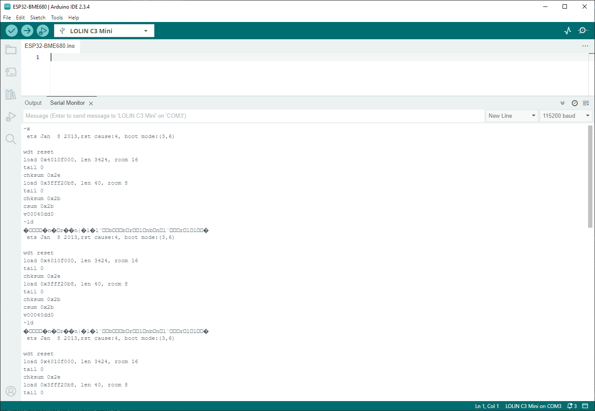

As long as there are a few words of english and technical codes on a loop, you're all right. But if everything is ? and square characters, try one of these:
* check the baud rate;
* use the "reset" button on the ESP device;
* unplug/replug from USB;
* try another USB port;
* close and restart Arduino IDE;
* reboot the computer.

I've had to close the Serial Monitor, unplug from USB, close Arduino IDE and try again many times. Sometimes several times in a row, sometimes as many as 15 failed attempts in a row, and sometimes I had to resort to a PC reboot to get anything working. I have no clue if this is more a driver or a hardware reliability issue, but either way, we just have to work around it. I've heard of other people who never had these issues. :shrug:

Also, I have suffered through the occasional blue screen for this project. Expect this and prepare accordingly (save often).

At this point, close the Serial Monitor and go back to the Output tab, then paste the code in the sketch, adjust the Wifi SSID and other constants in the code, and finally go ahead and select "Sketch > Upload" from the menus (or simply the -> arrow displayed at the top of Arduino IDE). Reopen the Serial Monitor after the upload is done.

Here is a table of the constants that should be adjusted in the code before flashing:

|Constant|Devices|Required by (project)|Description|
|-|-|-|-|
|MESH_PREFIX|ESP8266, ESP32|wifi.h|Name of the WiFi mesh network (SSID)|
|MESH_PASSWORD|ESP8266, ESP32|wifi.h|Password to the WiFi mesh|
|MESH_PORT|ESP8266, ESP32|painlessMesh.h|Default is probably fine, look it up for details|
|MESH_CHANNEL|ESP8266, ESP32|wifi.h|This _NEEDS_ to be the same as your home WiFi|
|MESH_MAXCONN|ESP8266, ESP32|painlessMesh.h|Not sure what this does, look it up for details|
|MESH_ROOT_NODE|ESP8266, ESP32|painlessMesh.h|Micro optimization: the ID of the ESP32 node, see the serial monitor when it starts|
|MESH_ROOT_HOST|ESP32|painlessMesh.h|A made-up hostname when connecting to the home WiFi|
|STATION_SSID|ESP32|wifi.h|The name (SSID) of your home network|
|STATION_PASSWORD|ESP32|wifi.h|The password to your home network|
|HTTP_HOST|ESP32|ArduinoHttpClient.h|The hostname that has the web server to store the readings|
|HTTP_PORT|ESP32|ArduinoHttpClient.h|The port of the web server that stores the readings|
|HTTP_PATH|ESP32|ArduinoHttpClient.h|A path on the web server, should you want to host several things alongside each other|
|HTTP_METHOD|ESP32|ArduinoHttpClient.h|Method for the HTTP requests to send the readings with, default to POST|
|HTTP_USERAGENT|ESP32|ArduinoHttpClient.h|User-Agent for the HTTP requests|
|LED|ESP8266, ESP32|griotte|The pin number for the main LED in case of error|

The compiling step takes a little while and Arduino IDE should be able to automatically upload the program to the device like this:
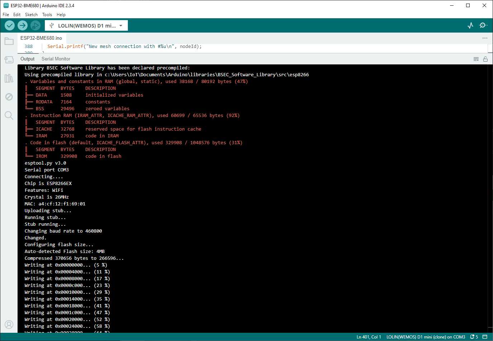

If you get to the gradual "writing %" step, chances are the process will finish (when it fails, it usually does so before this step) and you'll get a success message in the Output. My IDE froze after showing me this message just as I was demoing this now, but I closed and restarted the IDE, opened up the Serial Monitor tab again and I can see my program logging stuff so I'm good.

Caution: Some ESP32/8266 devices and some versions of the esptool.py program, or some combinations of these, will hang the upload for a few seconds after compiling, waiting for you to push a button on the device. If that is the case for you, be aware that there is a non automated process to flash your device. In this case, you need to hold the RESET / RST button on your micro controller when the IDE prompts you to do so (but the message in the Output won't be this self evident), at exactly the right point, and let go of the button as soon as the IDE tells you to. Usually, it just takes finding the correct time to push the button and to hold it for a second or two. This process is because your device needs to be set in "writing mode" so to speak, and is otherwise write protected.

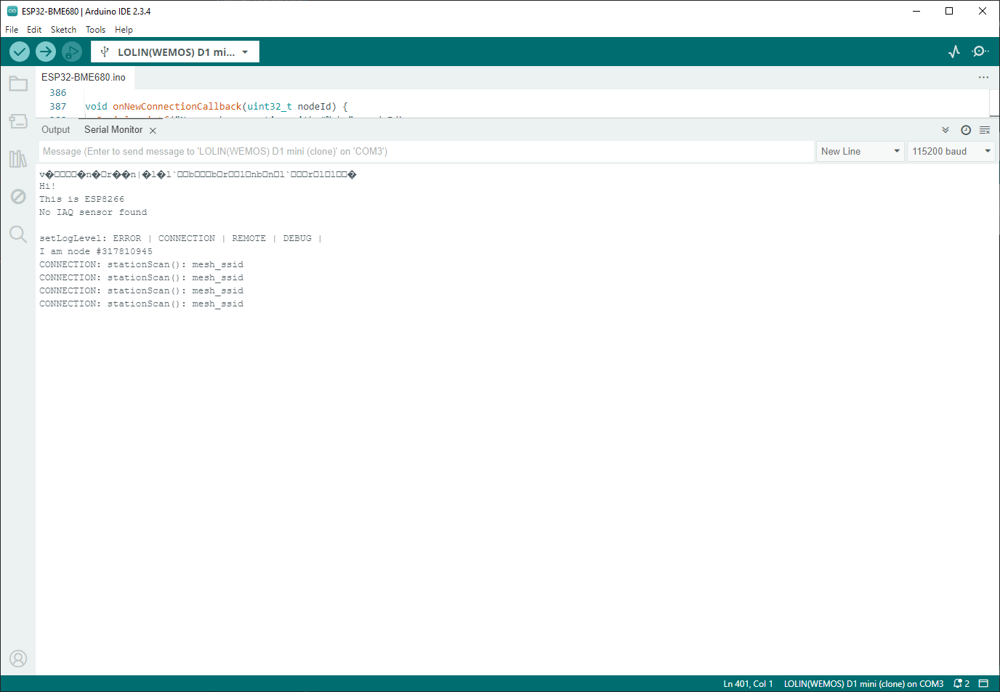

^ Shown above: Arduino IDE Serial Monitor running my program on a recently flashed ESP8266, without an attached BME680 sensor.


## D- Soldering the sensor

You can do this before or after flashing the program to the hardware, it shouldn't matter.

_Note: my work here is liberally adapted from the following tutorial: https://randomnerdtutorials.com/esp8266-nodemcu-bme680-sensor-arduino/_

As I understand it, the BME680 sensor can be controlled in two ways; either with SPI (meaning 4 GPIO connections), or with I2C (meaning 2 GPIO connections). It looks like I2C is generally the more popular protocol, and also my testing wasn't successful with SPI (incidentally, it also requires +50% soldering work), so I went with I2C.

Here is a copy of the wiring (from that tutorial) that I have been following:
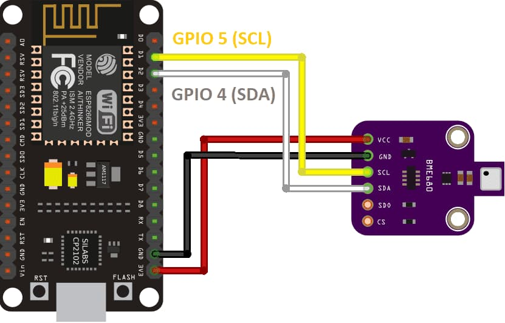

Of course your ESP8266 or your BME680 may look different, and you should absolutely look up the schematics from your manufacturer (they are sometimes called "pinouts"), but the connections are often labelled in the same way.

A word of caution: do not confuse the 5v and the 3.3v pins. They do not have the same function. The 5v (in) pin is only used to power the ESP device itself (when not using a USB cable), not to wire it to other components and sensors. For this project, we want to use only the 3.3v (out) pin. Fittingly, the "5v in" pin is labeled "Vin" in the diagram above, in true space-saving fashion.

Example of what it may look like:


If you were to plug the finished device in your USB port and monitor the serial console again, it should say something like "IAQ sensor found at address 0xXYZ". However, if it keeps saying "No IAQ sensor found", then something is probably wrong with the wiring or with the components. In that case, you may get some BSEC/BME680 error/warning codes to probably help you figure it out.

Normally, the device would start the self calibration process, which lasts a few minutes, and connect to the WiFi mesh to upload its readings.

Note: This WiFi mesh network is advertised as a TCP mesh with a port number, and I have found that I can actually connect to it with my phone despite the port number. Of course my phone won't have Internet but, if I were to guess one of the node's IP address, I could interact with it. This version of my program doesn't do that, but I know that it could. I simply prefer to have the nodes send their readings upstream and interact with the RPI0W.

Note: Many people seem to prefer programming their mesh IoT networks with a queue, using the MQTT protocol. It may very well be that painlessMesh uses that under the hood, but in any case, I have found that, without adding MQTT explicitly, the data packets find their way upstream on their own. I haven't found the increased complexity of adding MQTT useful in this case, as I don't need to control each node. But even if I needed that, painlessMesh offers enough helpers as it is, for me at least.


## E- Web server components

The basic command looks like this:

```sh
git clone https://github.com/GuillaumeRossolini/griotte.git
sudo mkdir /var/run/griotte
sudo chown -R www-data /var/run/griotte
sudo chown -R www-data:pi griotte
cd griotte/www
sudo -u www-data php -S 0.0.0.0:8080
```

The script will listen to the ESP32, which will be pushing measurements constantly (in my case that's 10 nodes every 3 seconds, spread unevenly).

Measurements are saved locally in an SQLite database, which happens to be a file on disk. I chose the PHP development web server mostly because 1- it is really easy to spin one up, 2- it only allows for a single HTTP connection at a time, so there is no issue with concurrency races (and the SQLite driver would not allow it anyway) and 3- it was preinstalled with PiHole (v5) that is also running on this Pi Zero.

The same web server also serves pretty graphs for me, the human end-user. These graphs usually take a fair bit longer to compute, and the time it takes depends on the number of records in the database. I like having first an overview of the entire house (this means WHERE + GROUP BY + ORDER BY) and then every room with a detailed graph (that's a loop with a different WHERE at every iteration, and ORDER BY).

Writing to the database is constant-time, regardless of the size of the database, but reading from it gets (much) slower as the database grows, even with indexes and prepared statements. Can't expect much from MicroSD storage, after all. Current version of these scripts is only one database for a few months worth of measurements, which is a 63MB file at this point and takes 40s to back up to my computer, if that is any indication of how long it takes to query the entire database.

The PHP app is not based on any framework, I'm only using PDO for the database layer and ChartJS for the graphs. There are even a few `goto` so as to not think about an overly complex structure, this is a really sequential app. There you go.

I tried to implement a number of failsafes and to think "embedded", as in, avoid writing data when all I need is a timestamp (`filemtime` is great).

I also tried to write to the file system as little as possible. There are two timers:
* One is for readings for each node, where we may not want to save them every time the node pings home (that's every 3 second) so I used the filesystem to skip 60s per node;
* The other is global, in order to avoid loading the SQLite database every minute for every node (the higher the number of nodes, the more often this happens: that's once every 6s in my case), so again I used the filesystem to buffer 5 minutes of readings and to commit those after this delay has run out.

Before implementing this last buffer, every write used to take a few hundred ms (and as I said, that was every 6s on average in my case).

But with this strategy:
* skipping data that is too recent takes 2ms, it's only a filesystem stats read;
* buffering data for later commit also takes 2ms, it's a plaintext append operation;
* committing data from text file to SQLite for the last 5 minutes (that's about 50 readings in my case) takes about 8s.

The web server buffers any incoming HTTP requests as well (because it is a single PHP process by design). Therefore, readings that may have come in while the commit was in progress, are processed quickly as soon as the commit is done. So, even the delay caused by the commit is irrelevant to the timestamps.

After all is said and done, I am uncertain that my buffer here does any good, performance-wise. Used to be a few hundred ms every 6s, now it's 8s every 5m. Then umbers look about the same? But at lease I can observe more easily what is happening with a few easy commands :
* `watch cat buffer.txt `
* `watch wc -l buffer.txt`
* `watch ls -alh buffer.csv readings.sq3 run/* db/v1/*/*/$(date +%Y-%m-%d)*`


## F- Linux service components

To gather and store the data, and provide it on request in easy to consume charts for us humans.

```bash
sudo cp griotte.service /etc/systemd/system/
sudo systemctl daemon-reload
sudo systemctl enable griotte.service
sudo systemctl start griotte.service
sudo reboot now
```

Read the logs with:
```bash
# -b means "since last boot" and -f means "follow/tail"
journalctl -u griotte -b -f
```

If you need to modify the service file, run this afterwards:
```bash
sudo systemctl daemon-reload
sudo systemctl restart griotte.service
```


## G- Database backups

Save this as a .bat file to run in Task Scheduler, or click on it whenever you like:
```cmd
CALL wsl.exe -e /mnt/c/Users/IoT/Documents/sync-readings.sh
PAUSE
```

This is the `sync-readings.sh` script:
```bash
#!/usr/bin/env bash

time scp \
	pihole-gr:/home/pi/griotte/db/v1/*/*/*.sq3 \
	/mnt/c/Users/IoT/Documents/bme680-readings/v1/

time scp \
	pihole-gr:/home/pi/griotte/*.sq3 \
	/mnt/c/Users/IoT/Documents/bme680-readings/big_$(date +%Y-%m-%dT%H-%M-%S).sq3

find \
	/mnt/c/Users/IoT/Documents/bme680-readings \
	-type f \
	-name "*.sq3" \
	-printf "%CY-%Cm-%Cd %CT\t%u\t%M\t%kK\t%h\t%f\n"
```


## Known issues & Wishlist

* when a sensor starts returning incorrect readings, it should recalibrate or self reset
* when a node fails to reconnect to the mesh, it should self reset
* the ESP32 is flooding my local DNS resolver logs, it doesn't seem to cache any entries
* changes to the mesh topology woud be useful in the database (only the ESP32 point of view)
* the nodes shouldn't have to wait for the BME sensor to finish self calibrating (air quality), to send other readings (temperature, humidity, barometric pressure)
