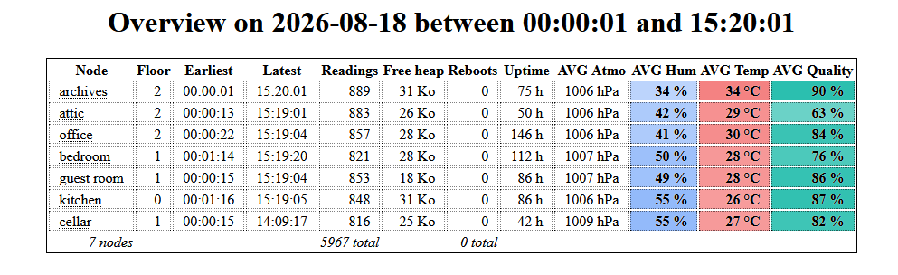

# Griotte (GR IoT)

This project is a DIY network of low cost air quality sensors for individual homes, mostly independent from the home network.

I am aware that low cost sensors are not precise, so that wasn't my goal. Rather, I wanted to keep track of trends over time: does a room in the house have really bad air flow, are there moments in the day that I should be wary of...

(lots of documentation is missing; please feel free to let me know if you are interested, that will boost me)


## Overview

I wanted an easy to read overview of the air quality in my house, with controls for the time period and the ability to narrow down to each room.

My network looks like this (here with 3 sensors):


The ESP8266 nodes collect the readings from the sensor. They are firmly on their own WiFi mesh network, while the Raspberry Pi is on the home network. The ESP32 is connected to both networks and acts as a bridge, receiving all readings and forwarding them to the Pi for storage.

In this case, "mesh network" means that the IoT network can be extended by simply adding more nodes, even if they are out of range of the home WiFi.

Here is how the webpage presents the sensor readings once they are collected on the Pi:


There is also a graph for each node to represent how each metric evolved over the course of the day.

A griotte:


For those so inclined, there are [other screenshots in the doc/img folder](./doc/img) and [some videos on my PeerTube account](https://video.infosec.exchange/w/a78x2MiuKruzen83Cf3Dpe).


## Approximate cost

Let's say 3 sensors (these costs are rounded up from when I bought the parts):

|unit price (€)|nb|part|
|---|---|---|
|6|3|BME680 sensor|
|2|3|ESP8266 micro controller|
|3|1|ESP32 micro controller|
|4|1|USB wall plug (bundle of 5)|
|1|1|USB cable (bundle of 5)|
|19|1|Raspberry Pi Zero W|
|2|1|MicroSD|
|2|1|wires for soldering (bundle of 100)|
|4|1|soldering iron|
|3|1|soldering flux/paste/wire|
|3|1|soldering mat|

That's €32 for only the micro controllers and sensors, or €53 with the Pi Zero if you don't have one laying around already, or less than €65 if you need to buy everything from the list. Don't forget ventilation for the fumes when soldering.

Every additional Griotte is an additional €10, where most of the cost is in the sensor.

As I mentioned earlier, the BME680 sensor is not reliable enough for precise readings. This is because it simply measures an electrical resistance across its surface. For better readings, try one of the laser based modules (I haven't) but my program doesn't work with them yet.

(Also, should you need a soldering kit, there are probably better deals including holding claws, which I find very useful, and perhaps a magnifying glass + lights; your choice.)

You may also find it helpful to have a spare keyboard & screen and the corresponding cables when working with your Pi Zero. In that case, pay close attention to your chosen Pi's documentation for the connectors.

For reference, my PiZW0 is handling ten of these griottes with no issues. This is as cheap as you can go with MicroSD storage. Feel free to add backups on top of that.

Additional requirement: A computer with the same kind of USB port available, that these cables are meant for.


## A- Hardware components: ESP8266, BME680, ESP32, Raspberry Pi Zero W

This is a bunch of computer parts that will need to be soldered or plugged together.

/!\ Soldering equippment needed: solder iron, solder paste/flux, colored wires, mask, ventilation _etc_.

I wanted to build a network of low cost and low power devices. The main objective was ease of setup more ease of build: I should be able to make (solder & flash) one griotte, place it wherever in the house and the network would sort itself out.

In this picture, the sattelites dishes on the left represent my sensors. In the context of a mesh network, they are generally called nodes but I refer to them as griottes.


There is a number of griottes around the house, each built with a BME680 sensor attached to an ESP8266 micro controller, and they self organize into a coherent network (called a mesh network) over a WiFi network. This means that I can unplug a griotte without breaking the network, then plug it back in perhaps in another part of the house, and they will all find a new network map by themselves, without my involvement. Obviously, I still need to take WiFi signal strength into account, because their antenna is small. In my case, as long as there is one griotte per room, it works fine.

A central unit, built with an ESP32 micro controller, receives readings from each griotte, meaning every 3 seconds because that is the shortest delay allowed by the BME680 sensor. This micro controller is located close to my home WiFi router because it needs to bridge the IoT network and my home network, and it forwards all the readings to a dedicated mini computer on my home network for storage. It doesn't need to be in close proximity to more than one of the griottes, since they self organize around this unit. This is the "root" of the mesh WiFi.

The two WiFi networks must share the same channel for this to work.

Finally, a small computer resides on my home network with a web server to gather & store all the readings that the ESP32 is forwarding. I chose a Raspberry Pi Zero W for this, because 1- it's small and can be placed anywhere, and 2- it's easy to reinstall from scratch if need be.

The web server determines which readings to store and which to ignore, because I don't actually need to store readings every 3 seconds for every node. I prefer to waste a little WiFi bandwidth, it helps with reliability. The bandwidth is really not an issue, each payload is smaller than the HTTP headers.

_To sum up: each ESP8266 node needs to be able to talk to at least one other ESP8266, and at least one of them needs to be in range of the single ESP32, which in turn needs to be able to reliably reach the RPI0W._


## B- Setting up Arduino IDE

This is programming code that needs to be compiled and flashed to the ESP8266 and ESP32 hardware.

There are two pieces of software that need to be written:
- one for the ESP8266 and its attached BME680 sensor;
- the other for the ESP32.

For this project though, I conflated both programs into one source file using numerous ifdef statements.

I went with Arduino IDE for its ease of use for a single project. I am a beginner in this, after all.

_/!\ When Arduino IDE starts, it will prompt you to update all your dependencies in one click. Do NOT do this, unless you are prepared for dependency headaches. Get in the habit of hitting the ESC key to cancel that prompt._

In this project is a file called "ESP32-BME680.ino": that's my program, also called sketch in the context of Arduino IDE. I failed to document the exact dependencies as I went along and added more and removed others, so I'll list everything here...

In the Arduino IDE Essential boards manager URL field (look it up in Preferences), this is what I have:

```
http://arduino.esp8266.com/stable/package_esp8266com_index.json,https://github.com/espressif/arduino-esp32/releases/download/3.3.8/package_esp32_dev_index.json,https://github.com/espressif/arduino-esp32/releases/download/3.3.8/package_esp32_index.json
```

Which translates to the following URLs, separated by a comma:
- http://arduino.esp8266.com/stable/package_esp8266com_index.json
- https://github.com/espressif/arduino-esp32/releases/download/3.3.8/package_esp32_dev_index.json
- https://github.com/espressif/arduino-esp32/releases/download/3.3.8/package_esp32_index.json

The Board Managers are what allow you to choose your ESP8266 and ESP32 devices in Arduino IDE so that you can interact with them: flash, debug _etc._ Flashing means writing the program to the device, and debugging (to me) mostly means having logs show up on the serial console.

The following are my installed Board Manager versions:
- ESP32 v3.3.11 by Espressif systems
- ESP8266 v3.1.2 by ESP8266 community

My best guess at the actual libraries I was required to install were (some are installed automatically by Arduino IDE from the Includes, others aren't):

|Name|Version|Targets|URL|
|-|-|-|-|
|Painless Mesh|v1.5.7|ESP32, ESP8266|https://gitlab.com/painlessMesh/painlessMesh|
|ArduinoJson|v6.21.6|ESP32|https://arduinojson.org/|
|AsyncTCP|v3.5.0|ESP32|https://github.com/ESP32Async/AsyncTCP|
|ESPAsyncTCP|v1.2.4|ESP8266|https://github.com/dvarrel/ESPAsyncTCP|
|HttpClient|v2.2.0|ESP32|https://github.com/amcewen/HttpClient|
|base64|v1.3.0|ESP32|https://github.com/Densaugeo/base64_arduino|

The ArduinoJson library had to be held back even though there is a newer major version available.

In case I was mistaken with my short list, here are all the dependencies that I have on my computer:

|Name|Version|Authors|URL|
|-|-|-|-|
|ArduinoHttpClient|v0.6.1|Arduino|https://github.com/arduino-libraries/ArduinoHttpClient|
|Adafruit_BME680|v2.0.6|Adafruit|https://github.com/adafruit/Adafruit_BME680|
|Adafruit_BusIO|v1.17.4|Adafruit|https://github.com/adafruit/Adafruit_BusIO|
|Adafruit-GFX-Library|v1.12.6|Adafruit|https://github.com/adafruit/Adafruit-GFX-Library|
|Adafruit SSD1306|v2.5.17|Adafruit|https://github.com/adafruit/Adafruit_SSD1306|
|Adafruit Unified Sensor|v1.1.15|Adafruit|https://github.com/adafruit/Adafruit_Sensor|
|ArduinoJson|v6.21.6|Benoit Blanchon|https://arduinojson.org|
|AsyncTCP|v3.5.0|ESP32Async|https://github.com/ESP32Async/AsyncTCP|
|BME68x Sensor library|v1.3.40408|Bosch Sensortech|https://github.com/BoschSensortec/Bosch-BME68x-Library|
|BSEC Softare Library|v1.6.1480|Bosch Sensortech|https://github.com/BoschSensortec/BSEC-Arduino-library|
|ESP ASync WebServer|v3.12.0|ESP32Async|https://github.com/ESP32Async/ESPAsyncWebServer|
|ESPAsyncTCP|v1.2.4|dvarrel|https://github.com/dvarrel/ESPAsyncTCP|
|HttpClient|v2.2.0|Adrian McEwen|https://github.com/amcewen/HttpClient|
|Painless Mesh|v1.5.7|Coopdis, Scotty Franzyshen, Edwin van Leeuwen, Germán Martín, Maximillian Schwartz, Doanh Doanh|https://gitlab.com/painlessMesh/painlessMesh|
|PubSubClient|v2.8|Nick O'Leary|https://pubsubclient.knolleary.net|
|RTCLib|v2.1.4|Adafruit|https://github.com/adafruit/RTClib|
|SdFat|v2.3.0|Bill Greirman|https://github.com/greiman/SdFat|
|TaskScheduler|v4.0.8|Anatoli Arkhipenko|https://github.com/arkhipenko/TaskScheduler|
|base64|v1.3.0|Densaugeo|https://github.com/Densaugeo/base64_arduino|
|bsec2|v1.7.2502|Bosch Sensortech|https://github.com/boschsensortec/Bosch-BSEC2-Library|


## C- Flashing a micro controller (either ESP32 or ESP8266)

I am by no means an expert in this, but here is my process.

Open up Arduino IDE and plug your ESP device in whichever USB port is available. Preferrably not through a USB hub, but directly to your PC.

Select the device in Arduino IDE. The most straightforward way is using the drop-down list near the menus at the top of the program: "Select other board and port..."

The driver names in Arduino IDE tend to change over time. Best I can tell, these seem to be working fine for the boards that I have:
|hardware|Arduino IDE driver|
|-|-|
|ESP8266|LOLIN(WEMOS) D1 mini (clone)|
|ESP32-C3|LOLIN C3 Mini|

To check that your board is working, make sure the Serial Monitor is open (enable it in the Tools menu) and that its baud rate matches the one in my program (that's 115200 baud). The Serial Monitor will need to be closed for the actual flashing process.

If everything is working correctly, you should see something like this for ESP8266:


As long as there are a few words of english and technical codes on a loop, you're all right. But if everything is question marks and square characters, try one of these:
* check the baud rate;
* use the "reset" button on the ESP device;
* unplug/replug from USB;
* try another USB port;
* make sure no other programs are maintaining a connection to your hardware, for example Task Manager or Device Manager on Windows;
* close and restart Arduino IDE;
* reboot the computer.

Also, I have suffered through the occasional blue screen for this project. Expect this and prepare accordingly (save often).

At this point, close the Serial Monitor in Arduino IDE and go back to the Output tab, then paste the code in the sketch, adjust the Wifi SSID and other constants in the code, and finally go ahead and select "Sketch > Upload" from the menus (or simply the `->` arrow displayed at the top of Arduino IDE). Reopen the Serial Monitor after the upload is done and you will start to see what the microprogram is doing: joining the network, attempting to locate other nodes and uploading sensor values.

Here is a table of the constants that can be adjusted in the code before flashing:

|Constant|Devices|Required by (project)|Description|
|-|-|-|-|
|MESH_PREFIX|ESP8266, ESP32|wifi.h|Name of the WiFi mesh network (SSID)|
|MESH_PASSWORD|ESP8266, ESP32|wifi.h|Password to the WiFi mesh|
|MESH_PORT|ESP8266, ESP32|painlessMesh.h|Default is probably fine, look it up for details|
|MESH_CHANNEL|ESP8266, ESP32|wifi.h|This _NEEDS_ to be the same as your home WiFi|
|MESH_MAXCONN|ESP8266, ESP32|painlessMesh.h|Not sure what this does, look it up for details|
|MESH_ROOT_NODE|ESP8266, ESP32|painlessMesh.h|Micro optimization: the ID of the ESP32 node, see the serial monitor when it starts|
|MESH_ROOT_HOST|ESP32|painlessMesh.h|A made-up hostname when connecting to the home WiFi|
|STATION_SSID|ESP32|wifi.h|The name (SSID) of your home network|
|STATION_PASSWORD|ESP32|wifi.h|The password to your home network|
|HTTP_HOST|ESP32|ArduinoHttpClient.h|The hostname that has the web server to store the readings|
|HTTP_PORT|ESP32|ArduinoHttpClient.h|The port of the web server that stores the readings|
|HTTP_PATH|ESP32|ArduinoHttpClient.h|A path on the web server, should you want to host several things alongside each other|
|HTTP_METHOD|ESP32|ArduinoHttpClient.h|Method for the HTTP requests to send the readings with, default to POST|
|HTTP_USERAGENT|ESP32|ArduinoHttpClient.h|User-Agent for the HTTP requests|
|LED|ESP8266, ESP32|griotte|The pin number for the main LED in case of error|

The compiling step takes a little while and Arduino IDE should be able to automatically upload the program to the device like this:


If you get to the gradual "writing %" step, chances are the process will finish (when it fails, it usually does so before this step) and you'll get a success message in the Output. My IDE froze after showing me this message just as I was demoing this now, but I closed and restarted the IDE, opened up the Serial Monitor tab again and I can see my program logging stuff so I'm good.

Caution: Some ESP32/8266 devices and some versions of the esptool.py program, or some combinations of these, will hang the upload for a few seconds after compiling, waiting for you to push a button on the device. If that is the case for you, be aware that there is a non automated process to flash your device. In this case, you need to hold the RESET / RST button on your micro controller when the IDE prompts you to do so (but the message in the Output won't be this self evident), at exactly the right point, and let go of the button as soon as the IDE tells you to. Usually, it just takes finding the correct time to push the button and to hold it for a second or two. This process is because your device needs to be set in "writing mode" so to speak, and is otherwise write protected.


^ Shown above: Arduino IDE Serial Monitor running my program on a recently flashed ESP8266, without an attached BME680 sensor.


## D- Soldering the BME680 sensor onto ESP8266

You can do this before or after flashing the program to the hardware, it shouldn't matter.

_Note: my work here is liberally adapted from the following tutorial: https://randomnerdtutorials.com/esp8266-nodemcu-bme680-sensor-arduino/

As I understand it, the BME680 sensor can be controlled in two ways; either with SPI (meaning 4 GPIO connections), or with I2C (meaning 2 GPIO connections). It looks like I2C is generally the more popular protocol, and also my testing wasn't successful with SPI (incidentally, it also requires a little more soldering work), so I went with I2C.

Here is a copy of the wiring (from that tutorial) that I have been following:


Of course your boards may look different, and you should absolutely look up the schematics from your manufacturer (they are sometimes called "pinouts"), but the connections are often labelled in the same way.

A word of caution: do not confuse the 5v and the 3.3v pins. They do not have the same function. The 5v (in) pin is only used to power the ESP device itself (when not using a USB cable), not to wire it to other components and sensors. For this project, we want to use only the 3.3v (out) pin connected to the sensor's VCC pin. Fittingly, the "5v in" pin is labeled "Vin" in the diagram above, in true space-saving fashion.

Example of what it may look like:


If you were to plug the finished device in your USB port and monitor the serial console again, it should say something like "IAQ sensor found at address 0xXYZ". However, if it keeps saying "No IAQ sensor found", then something is probably wrong with the wiring or with the components. In that case, you may get some BSEC/BME680 error/warning codes to probably help you figure it out.

Normally, the device would start the self calibration process, which lasts a few minutes, and meanwhile it would also connect to the WiFi mesh to upload its readings.

Note: This WiFi mesh network is advertised as a TCP mesh with a port number, and I have found that I can actually connect to it with my phone despite the port number. Of course my phone won't have Internet while connected this way but, if I were to guess one of the node's IP address, I could interact with it. This version of my program doesn't do that, but I know that it could. I simply prefer to interact with the webserver on the RPI0W.

Note: Many people seem to prefer programming their mesh IoT networks with a queue, using the MQTT protocol. It may very well be that painlessMesh uses that under the hood, but in any case, I have found that, without adding MQTT explicitly, the data packets find their way upstream on their own. I haven't found the increased complexity of adding MQTT useful in this case.


## E- Setting up the web server on the Raspberry Pi

This project was initially using a systemd service, but I since moved on to Docker Stack. I am confident that anyone preferring systemd could read the Dockerfile recipe easily enough.

The basic command looks like this:

```sh
git clone https://github.com/GuillaumeRossolini/griotte.git
cd griotte
docker build -t griotte:v2.3.9 .
docker stack deploy -c docker-compose.rpi0.yml --prune --detach=false griotte
```

There is only one custom image in this project, hence only one build operation, but it is deployed several times and there is also nginx in there.

```
pi@pi0-griot:~ $ docker service ls
ID             NAME               MODE         REPLICAS   IMAGE                        PORTS
mhxn1qnw8hym   griotte_graphs     replicated   1/1        griotte:v2.3.9
2a4oztrk4g5h   griotte_incoming   replicated   1/1        griotte:v2.3.9
z5dbsdua6rxu   griotte_proxy      replicated   2/2        nginx:1.31-alpine            *:80->80/tcp, *:8081->8081/tcp
```

```
pi@pi0-griot:~ $ docker stats --no-stream
CONTAINER ID   NAME                                           CPU %     MEM USAGE / LIMIT   MEM %     NET I/O           BLOCK I/O         PIDS
0fdde00bb9ac   griotte_incoming.1.j1q03nhuv80qu42dlt3mqgl0z   0.58%     7.512MiB / 50MiB    15.02%    1.02GB / 380MB    44.6MB / 310MB    4
8b50054307f6   griotte_graphs.1.d3b0zr8pgpvrrewuhrwu0fvef     0.03%     26.98MiB / 50MiB    53.95%    74.8kB / 4.18MB   37.6MB / 16.9MB   4
97534fe462a8   griotte_proxy.1.vy1i637lk171s608kvzl6a23z      0.03%     1.312MiB / 50MiB    2.62%     500MB / 736MB     5.54MB / 2.7MB    2
3fa13840211d   griotte_proxy.2.b0nzq7wp0yogfnmhxqafydfg4      0.53%     1.484MiB / 50MiB    2.97%     499MB / 735MB     4.92MB / 1.65MB   2
```

This is probably way overkill, I just wanted to be able to constrain the resources used when producing the web overview and the graphs. I found that this webpage can be slow and it can hog i/o so much that readings are lost and the mesh destabilizes.


The ESP32 node will be pushing measurements constantly (in my case that's 10 nodes every 3 seconds, spread unevenly).

Measurements are saved locally in an SQLite database, which happens to be a file on the Raspberry Pi Zero. As far as PHP is concerned, HTTP requests are handled within 7 to 15ms most of the time, up to 1.5s when data needs to be written to the database. However, ESP32 apparently needs much more time for each request, on average 0.25s and occasionally 1.3s, even without data storage.

A web server serves pretty graphs for me, the human end-user. These graphs usually take a fair bit longer to compute, and the time it takes depends on the number of records in the database. I like having first an overview of the entire house (this means WHERE + GROUP BY + ORDER BY) and then every room with a detailed graph (that's a loop with a different WHERE at every iteration, and ORDER BY).

|Service|Image|Description|
|-|-|-|
|graphs|griotte|Produces summary web pages and pretty graphs from the stored readings; has readonly access to the database|
|incoming|griotte|Handles sensor readings coming in, as well as other data the mesh sends for storage|
|proxy|nginx|Dispatches HTTP requests to the relevant upstream service; is the only service to publish ports|

Writing to the database is constant-time, regardless of the size of the database, but reading from it gets (much) slower as the database grows, even with indexes and prepared statements. Can't expect much from MicroSD storage, after all. Current version of these scripts is only one database for a few months worth of measurements, which is a 63MB file at this point and takes 40s to back up to my computer, if that is any indication of how long it takes to query the entire database.

The PHP app is not based on any framework, I'm only using PDO for the database layer and ChartJS for the graphs. There are even a few `goto` statements so as to not think about an overly complex structure, this is a really sequential app. There you go.

I tried to implement a number of failsafes and to think "embedded", as in, avoid writing data when all I need is a timestamp (`filemtime` is great).

I also tried to write to the file system as little as possible. There are two timers:
* One is for readings for each node, where we may not want to save them every time the node pings home (that's every 3 second) so I used the filesystem to skip 60s per node;
* The other is global, in order to avoid loading the SQLite database every minute for every node (the higher the number of nodes, the more often this happens: that's once every 6s in my case), so again I used the filesystem to buffer 5 minutes of readings and to commit those after this delay has run out.

Before implementing this last buffer, every write used to take a few hundred ms through the PHP SQLite driver (and as I said, that was every 6s on average in my case).

But with this method:
* skipping data that is too recent takes 2ms, it's only a filesystem stats read;
* buffering data for later commit also takes 2ms, it's a plaintext append operation;
* committing data from text file to SQLite for the last 5 minutes (that's about 50 readings in my case) takes less than 1s.

I can also observe easily what is happening with a few easy commands:
* `watch "cat run/buffer.csv | expand"`
* `watch wc -l run/buffer.csv`
* `watch ls -alh db/readings.sq3 run/* db/daily/*/*/$(date +%Y-%m-%d)*`
* `time /usr/local/bin/dbstats # on the host`


## F- Database backups

Save this as a .bat file to run in Task Scheduler (Windows), or click on it whenever you like:
```cmd
CALL wsl.exe -e /mnt/c/Users/IoT/Documents/griotte/linux/sync-readings.sh
PAUSE
```


## Known issues & ToDo/Wishlist

## Documentation
* improve the Docker docs
* write the Getting Started docs
* refactor the docs

## Microprogram
* when the Raspberry Pi Zero becomes unavailable for a while, the mesh collapses: restarting the ESP32 should be enough to for this (how about an HTTP request on /ping every few minutes?)
* when a sensor starts returning incorrect readings, (maybe?) its node should recalibrate or self reset
* batch the ESP32>RPI0 HTTP requests to better scale the number of nodes in the mesh w/r/t HTTP round-trip times
* batch (also) the ESP8266>ESP32 messages in case the root node is unavailable
* implement gradual backoff for the HTTP messages to the RPI0 in case the web server goes down, so that the mesh doesn't destabilize as a result of the increased delays and the ESP32 being busy (also see the first bullet point)
* node health & mesh status sent to dedicated endpoints
* estimate how much time the ESP32 spends on HTTP versus listening to the mesh, send it as part of the health payload
* upgrade ArduinoJson lib
* upgrade BSEC lib
* Home Assistant compatibility

## Webserver
* changes to the mesh topology are sent over HTTP (keeps the mesh alive) but currently not logged to the database
* improve default shell handling: aliases and other maintenance utilities when ssh'ing into the rpi etc.
* find a better solution for the database overlap currently required (because of timezones and small DB files)
* graphs data table: add MIN, MAX and current values but hidden by default, and radio buttons to switch (?), and how about STDDEV?

## Hardware
* thermal insulation is really needed between ESP8266 and the sensor: in warm temperatures with low wind, the micro controller board can't self regulate and the readings are skewed by several °C
* battery & solar recharge
* e-ink/e-paper screen

## Docker Swarm
* optimize writes on the Raspberry Pi Zero to reduce latency and storage wear (crontab service?)
* building the php-fpm image on Raspberry Pi Zero is possible but the first build took 1474s in my case, and subsequent builds still take a full minute
* alerts: watch the barometric pressure: at least 2 nodes show a 2+ drop in under 5 minutes (?)

## What I don't know what to do about
* cramming a bunch of these devices in a room will result in an unstable mesh, possibly due to interference
* in fact, using these devices in a wifi-crowded space won't work
